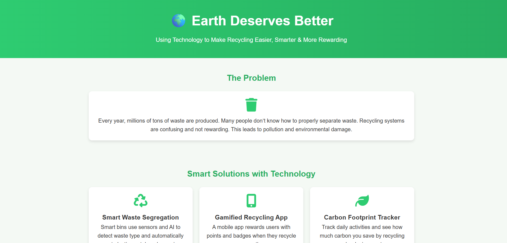
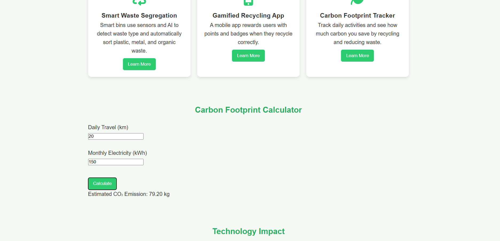
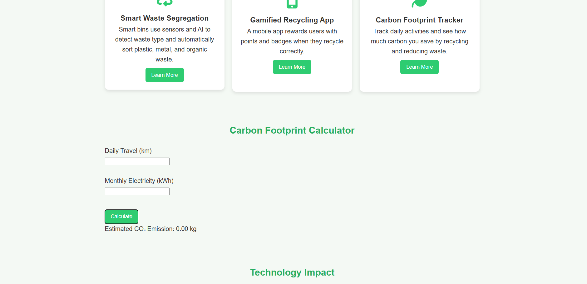

  

# 🌍 Earth Deserves Better

## 📌 Basic Details

### 👨‍💻 Team Name  
Tink-Her Hack Team  

### 👤 Team Members  
**Niamath** – [MES College Of Engineering,Kunnukara]

### 🔗 Live Project Link  
https://earth-deserves-better.vercel.app/

### 🎥 Demo Video  
https://youtu.be/s5Htonf17fI?si=amIk74SZyNQiZWmP

### 💻 GitHub Repository  
https://github.com/niamath25/tink-her-hack-temp/

---

## 📖 Project Description

**Earth Deserves Better** is a sustainability-focused web project that promotes smarter, easier, and more rewarding recycling using technology.

The platform creates awareness about waste management and encourages eco-friendly habits through interactive features and a modern, responsive design.

---

## ❗ Problem Statement

- Large amounts of waste are generated every day  
- Poor waste segregation reduces recycling efficiency  
- Lack of motivation discourages people from recycling  
- This leads to pollution and environmental damage  

---

## 💡 The Solution

This project introduces technology-driven solutions:

- ♻ Smart Waste Segregation Concept  
- 🎮 Gamified Recycling Reward System  
- 🌱 Carbon Footprint Calculator  
- 📊 Recycling Statistics Visualization  

These features make sustainability interactive, educational, and engaging.

---

## 🛠 Technical Details

### 💻 Technologies Used

- **HTML** – Website structure  
- **CSS** – Styling and responsive layout  
- **JavaScript** – Interactivity and logic  
- **Chart.js** – Data visualization  

### 🧰 Tools Used

- VS Code  
- Git & GitHub  
- Browser Developer Tools  

---

## ✨ Features

- Clean and responsive UI  
- Carbon footprint calculator  
- Recycling reward points system  
- Dark mode toggle  
- Smooth scroll and fade-in animations  
- Interactive recycling statistics chart  

---

## 📸 Screenshots

### 🌐 Homepage

  
Overview of the website interface.

---

### 🧮 Carbon Footprint Calculator

  
Users enter travel distance and electricity usage to calculate estimated CO₂ emissions.

---

### 🎮 Recycling Rewards System

  
Users earn points by clicking recycle and unlock badges.

---

### 🌙 Dark Mode UI

  
Modern dark mode theme for improved user experience.

---

## 🚀 How to Run the Project

1. Clone the repository using Git  
2. Open the project folder  
3. Open **index.html** in your browser  

No additional installation required.

---

## 🎯 What This Project Demonstrates

- Creative use of frontend web technologies  
- Real-world problem solving using sustainability concepts  
- JavaScript logic implementation  
- Interactive UI features  
- Data visualization using charts  
- Responsive and modern web design  

---

## 🤖 AI Tools Used (Transparency Section)

**Tool Used:** ChatGPT  

**Purpose:**
- Code structure guidance  
- UI improvement suggestions  
- Documentation formatting  

**Human Contribution:**
- Project idea and concept  
- Full frontend development  
- UI customization  
- Feature implementation  
- Testing and deployment  
- GitHub management  

---

## 👨‍💻 Author

**Niamath**  
Frontend Developer & Project Owner  

---

## 📜 License

This project is licensed under the MIT License.

---

Made with 💚 for Sustainability  
Because Earth Truly Deserves Better 🌍
